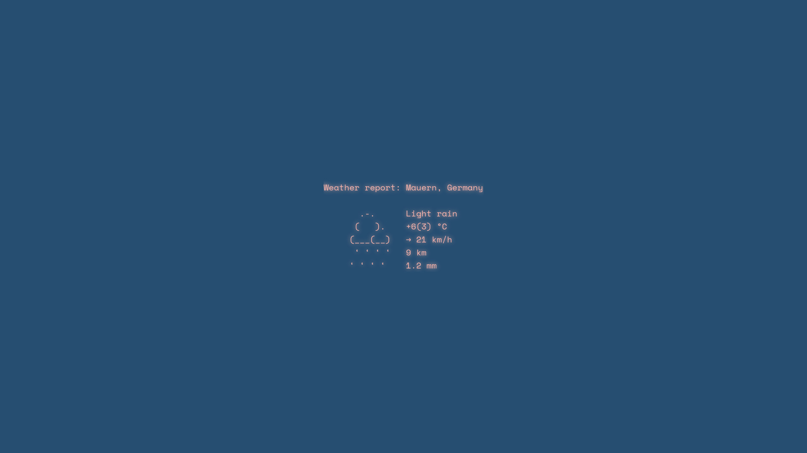

# Simple ASCII wallpaper maker


command used:
```
./wallpaper.sh
```

### Create simple wallpapers with a background and ASCII art in the middle.

### Configurable size, background color, text color, point size, ASCII art file and output.

# Option to use weather data from [wttr.in](https://wttr.in/) as ASCII art



command used:
```
./wallpaper.sh -p 20 -b "#264e70" -t "#f9b4ab" -o weather.jpg --weather
```